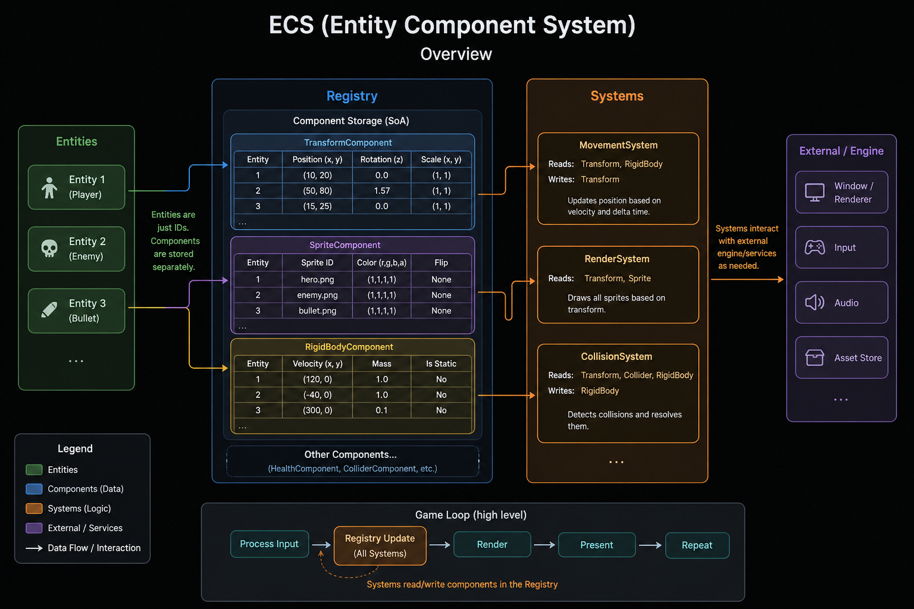

# Segfault Simulator

This is a lightweight engine built using the ECS pattern.

The engine comes with a few common systems, like movement and rigidbody. Game specific systems can inherit sfs::System and be added to scenes.

<p align="center">
  <a href="https://hurricane-pinecone.github.io/Segfault-Simulator/sampleGame.html" target="_blank" rel="noopener noreferrer">
    <strong>▶ Play the dogshit sample game</strong>
  </a>
</p>



## Overview

This project uses:

- **Conan (v2)** → dependency management
- **CMake + Presets** → build system

The project is structured as:

```text
engine/ → library
sampleGame/   → executable
```

- Engine is a reusable **library**
- sampleGame is the **entry point**
- Assets live next to the executable at runtime

## Initial Setup

### 1. Install dependencies (macOS)

```bash
brew install conan cmake
```

Initialize Conan:

```bash
conan profile detect --force
```

## Debug Build

### 2. Install dependencies

```bash
conan install . --build=missing -s build_type=Debug
```

### 3. Configure

```bash
cmake --preset debug
```

### 4. Build

```bash
cmake --build --preset debug
```

## Run

```bash
cmake --build --preset debug --target run
```

## Release Build

```bash
conan install . --build=missing -s build_type=Release

cmake --preset release
cmake --build --preset release

cmake --build --preset release --target run
```

## LSP / clangd setup

```bash
ln -sf build/Debug/compile_commands.json compile_commands.json
```

Restart your editor after this.

## Rebuilding

### TL;DR

```bash
conan install . --build=missing -s build_type=Debug
cmake --preset debug
cmake --build --preset debug --target run
```

### Normal rebuild

```bash
cmake --build --preset debug
```

### If `conanfile.txt` changes

```bash
conan install . --build=missing -s build_type=Debug
cmake --preset debug
```

### If `CMakeLists.txt` changes

```bash
cmake --preset debug
```

### If compiler/toolchain changes

```bash
conan profile detect --force
```

## Clean Build

```bash
rm -rf build compile_commands.json CMakeUserPresets.json
rm -rf engine/build

conan install . --build=missing -s build_type=Debug
cmake --preset debug
cmake --build --preset debug
```

## Assets

Assets are automatically copied to the executable directory:

```text
build/Debug/bin/
  sampleGame
  assets/
```

Game code uses:

```cpp
const std::string ASSET_ROOT = "./assets/";
```

## Important

Always run the game using one of these:

```bash
cmake --build --preset debug --target run
```

or:

```bash
cd build/Debug/bin
./sampleGame
```

Do **not** run from repo root:

```bash
./build/Debug/bin/sampleGame
```

This will break asset paths.

## Leak Detection

```bash
./scripts/run_leaks.sh
```

If it needs permissions

```bash
chmod +x scripts/run_leaks.sh
```

## Optional Aliases (zsh)

```bash
echo "alias crun='cmake --build --preset debug --target run'" >> ~/.zshrc
echo "alias crun-release='cmake --build --preset release --target run'" >> ~/.zshrc
source ~/.zshrc
```

Run with:

```bash
crun
crun-release
```
