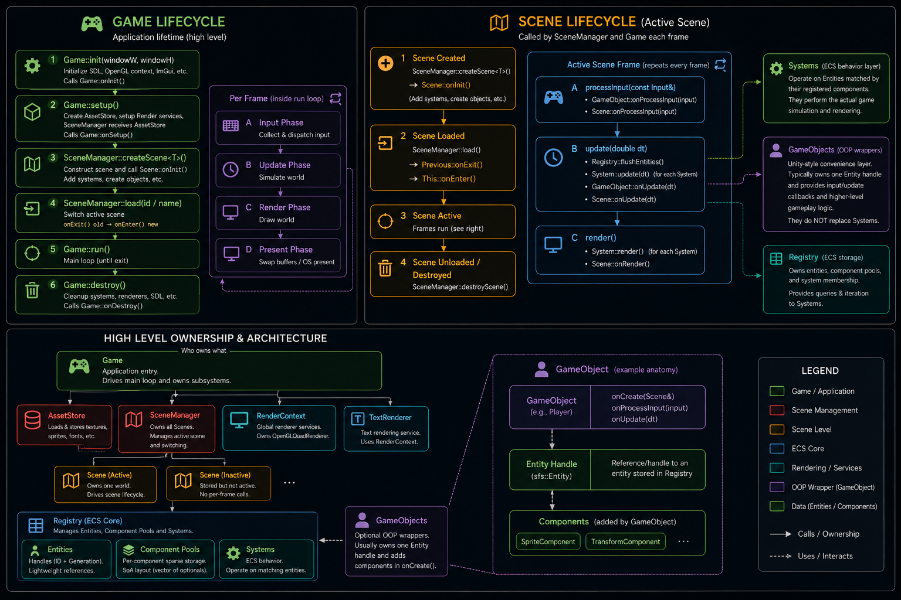

# Segfault Simulator

A lightweight 2D game engine with an ECS core and a Unity-style OOP layer for
game code. It renders either flat 2D scenes or isometric heightfield scenes
through a shared core. Build your game in C++ against the engine library, and
optionally drive it with a live Lua scripting API.

<p align="center">
  <a href="https://hurricane-pinecone.github.io/Segfault-Simulator" target="_blank" rel="noopener noreferrer">
    <strong>▶ Play the dogshit sample game</strong>
  </a>
  &nbsp;·&nbsp;
  <a href="https://hurricane-pinecone.github.io/Segfault-Simulator/samplePlatformer" target="_blank" rel="noopener noreferrer">
    <strong>▶ Play the sample platformer</strong>
  </a>
</p>




## Table of Contents

- [Overview](#overview)
- [Documentation](#documentation)
- [Prerequisites](#prerequisites)
- [Using SFS in Your Game](#using-sfs-in-your-game)
  - [Get the Engine Package](#get-the-engine-package)
  - [Require and Link It](#require-and-link-it)
  - [Raw CMake Install (no Conan)](#raw-cmake-install-no-conan)
  - [Runtime Assets](#runtime-assets)
- [The Sample Game](#the-sample-game)

## Overview

SegFaultSimulator (SFS) is a 2D game engine with two render paths over one core:

- An **ECS core** — entities, components, systems.
- An **SDL2 + OpenGL render runtime** with per-pixel point lighting, normal maps,
  and particles, drawn through one of two render systems:
  - **Flat 2D** (`FlatRenderSystem`) — screen-space sprites for side-on or
    top-down games, ordered by layer then Y.
  - **Isometric heightfield** (`IsometricRenderSystem`) — a grid of elevated
    columns with per-elevation lighting, terrain/sprite shadows, block geometry,
    and world-projected decals.
- A **live Lua scripting / modding API**.
- **Native** (macOS / Linux) and **web** (Emscripten / WebGL2) targets.

It ships as two libraries:

| Target             | Contents                                              | Dependencies |
| ------------------ | ----------------------------------------------------- | ------------ |
| `sfs::engine`      | The full render runtime.                              | SDL2, OpenGL |
| `sfs::engine-core` | The ECS, scripting, and particle core — no rendering. | none         |

Link `sfs::engine` to build a game; `sfs::engine-core` is for headless tools or
projects that bring their own rendering.

## Documentation

Documentation: **[hurricane-pinecone.github.io/Segfault-Simulator](https://hurricane-pinecone.github.io/Segfault-Simulator/)**
— architecture, particles & decals, and scripting, each with an overview and
deep-dive pages. Built from [`docs/`](./docs/overview.md) with MkDocs Material.

## Prerequisites

SFS is distributed with **Conan (v2)** and built with **CMake**. On macOS:

```bash
brew install conan cmake
conan profile detect --force
```

## Using SFS in Your Game

### Get the Engine Package

SFS is not published to a public Conan remote, so build the package from source
into your local Conan cache once:

```bash
git clone https://github.com/hurricane-pinecone/Segfault-Simulator.git
cd Segfault-Simulator
conan create .                          # sfs::engine (full runtime)
```

To package only the dependency-free core (no SDL/OpenGL):

```bash
conan create . -o "&:core_only=True"    # sfs::engine-core
```

### Require and Link It

Add the engine to your game's `conanfile.txt`:

```ini
[requires]
sfs-engine/0.1.0

[generators]
CMakeDeps
CMakeToolchain
```

Then link it in your `CMakeLists.txt`:

```cmake
find_package(engine REQUIRED)
target_link_libraries(myGame PRIVATE sfs::engine)   # or sfs::engine-core
```

The SDL / imgui / GLEW closure comes in transitively — you do not list those
yourself.

### Raw CMake Install (no Conan)

The engine also installs as a plain CMake package:

```bash
cmake --install <engine-build-dir> --prefix /path/to/engine
```

Point your build at it and consume the same targets:

```cmake
# cmake -D CMAKE_PREFIX_PATH=/path/to/engine ...
find_package(engine REQUIRED)
target_link_libraries(myGame PRIVATE sfs::engine)
```

### Runtime Assets

The engine loads a few runtime assets of its own (e.g. the default font).
`find_package(engine)` sets `ENGINE_ASSET_DIR` to their location; copy them next
to your executable:

```cmake
add_custom_command(TARGET myGame POST_BUILD
    COMMAND ${CMAKE_COMMAND} -E copy_directory
        "${ENGINE_ASSET_DIR}" "$<TARGET_FILE_DIR:myGame>/assets")
```

## The Sample Game

`sampleGame/` is a complete game built on SFS and the worked example of
everything above — it consumes the engine through `find_package(engine)` and
`sfs::engine`, exactly as your game does. Build and run it against the package:

```bash
conan create .
cd sampleGame
conan install . --build=missing -s build_type=Release
cmake --preset conan-release
cmake --build --preset conan-release --target run
```

The [`crun-sample-pkg`](./engine/README.md#optional-aliases-zsh) alias chains
these steps into one command.

For building the engine itself, the bundled workspace build, and tooling, see
[engine development](./engine/README.md).
