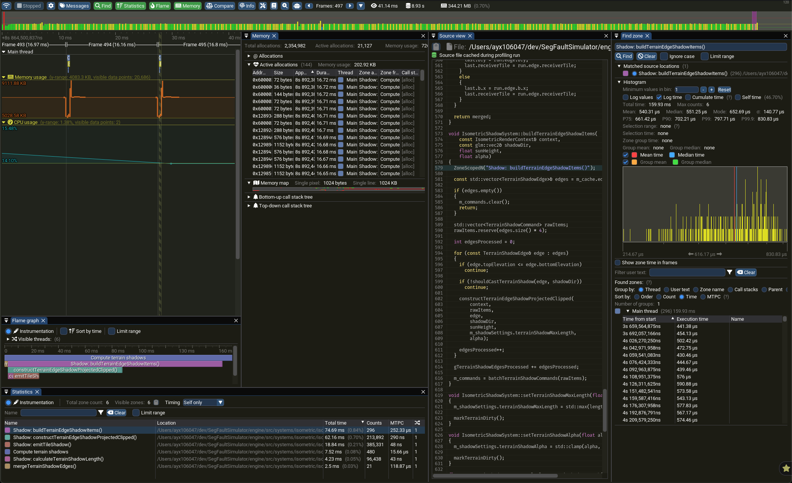

# Segfault Simulator

This is a lightweight engine built using the ECS pattern, with a Unity style OOP layer on top for the game client.

<p align="center">
  <a href="https://hurricane-pinecone.github.io/Segfault-Simulator" target="_blank" rel="noopener noreferrer">
    <strong>▶ Play the dogshit sample game</strong>
  </a>
</p>


## Table of Contents

- [Overview](#overview)
- [Documentation](#documentation)
- [Initial Setup](#initial-setup)
- [Debug Build](#debug-build)
- [Run](#run)
- [Testing](#testing)
- [Release Build](#release-build)
  - [Web build](#web-build)
- [LSP / clangd setup](#lsp--clangd-setup)
- [Rebuilding](#rebuilding)
  - [TL;DR](#tldr)
  - [Normal rebuild](#normal-rebuild)
  - [If `conanfile.txt` changes](#if-conanfiletxt-changes)
  - [If `CMakeLists.txt` changes](#if-cmakeliststxt-changes)
  - [If compiler/toolchain changes](#if-compilertoolchain-changes)
- [Clean Build](#clean-build)
- [Assets](#assets)
- [Important](#important)
- [Optional Aliases (zsh)](#optional-aliases-zsh)
- [Tooling](#tooling)
  - [Leak Detection](#leak-detection)
  - [Tracy Profiling](#tracy-profiling)
    - [Install Tracy Profiler (macOS)](#install-tracy-profiler-macos)
    - [Build and Run in Profiling Mode](#build-and-run-in-profiling-mode)
    - [Tracy Configuration](#tracy-configuration)

## Overview

This project uses:

- **Conan (v2)** → dependency management
- **CMake + Presets** → build system

The project is structured as:

```text
engine/ → library
sampleGame/   → executable
```

- Engine is a reusable **library**
- sampleGame is the **entry point**
- Assets live next to the executable at runtime

## Documentation

| Doc                                                          | What it covers                                                                               |
| ------------------------------------------------------------ | -------------------------------------------------------------------------------------------- |
| [Architecture](./docs/ARCHITECTURE.md)                       | Engine design: ECS core, the render seam, ownership model                                    |
| [Lua scripting](./engine/include/engine/scripting/README.md) | Giving a game a live Lua modding API (`ILuaApi` / `ILuaConfigurable`, bindings, runtime use) |

## Initial Setup

### 1. Install dependencies (macOS)

```bash
brew install conan cmake
```

Initialize Conan:

```bash
conan profile detect --force
```

## Debug Build

### 2. Install dependencies

```bash
conan install . --build=missing -s build_type=Debug
```

### 3. Configure

```bash
cmake --preset debug
```

### 4. Build

```bash
cmake --build --preset debug
```

## Run

```bash
cmake --build --preset debug --target run
```

## Release Build

```bash
conan install . --build=missing -s build_type=Release

cmake --preset release
cmake --build --preset release

cmake --build --preset release --target run
```

### Web build

The web build can't be run in debug because ImGUI is stripped from the build

```bash
rm -rf build-web
emcmake cmake -S . -B build-web -DCMAKE_BUILD_TYPE=Release
cmake --build build-web
cd build-web/bin
python3 server.py
```

Or, with the [`crun-web`](#optional-aliases-zsh) alias (configures, builds, and
serves in one step):

```bash
crun-web
```

## LSP / clangd setup

```bash
ln -sf build/Debug/compile_commands.json compile_commands.json
```

Restart your editor after this.

## Rebuilding

### TL;DR

```bash
conan install . --build=missing -s build_type=Debug
cmake --preset debug
cmake --build --preset debug --target run
```

### Normal rebuild

```bash
cmake --build --preset debug
```

### If `conanfile.txt` changes

```bash
conan install . --build=missing -s build_type=Debug
cmake --preset debug
```

### If `CMakeLists.txt` changes

```bash
cmake --preset debug
```

### If compiler/toolchain changes

```bash
conan profile detect --force
```

## Clean Build

```bash
rm -rf build
rm -rf engine/build

conan install . --build=missing -s build_type=Debug
cmake --preset debug
cmake --build --preset debug
```

## Assets

Assets are automatically copied to the executable directory:

```text
build/Debug/bin/
  sampleGame
  assets/
```

Game code uses:

```cpp
const std::string ASSET_ROOT = "./assets/";
```

## Important

Always run the game using one of these:

```bash
cmake --build --preset debug --target run
```

or:

```bash
cd build/Debug/bin
./sampleGame
```

Do **not** run from repo root:

```bash
./build/Debug/bin/sampleGame
```

This will break asset paths.

## Optional Aliases (zsh)

Add these to your shell config (`~/.zshrc`):

```bash
alias crun='conan install . --build=missing -s build_type=Debug && cmake --preset debug && cmake --build --preset debug --target run'
alias crun-release='conan install . --build=missing -s build_type=Release && cmake --preset release && cmake --build --preset release --target run'
alias crun-profile='conan install . --build=missing -s build_type=RelWithDebInfo && cmake --preset conan-relwithdebinfo && cmake --build --preset conan-relwithdebinfo --target run'
alias crun-tests='cmake -S . -B build-core -DENGINE_CORE_ONLY=ON -DCMAKE_BUILD_TYPE=Debug && cmake --build build-core --target luaTests && ctest --test-dir build-core --output-on-failure'
alias crun-web='emcmake cmake -S . -B build-web -DCMAKE_BUILD_TYPE=Release && cmake --build build-web --target run'
```

Reload your shell:

```bash
source ~/.zshrc
```

Then, from the project root:

```bash
crun          # debug build + run
crun-release  # release build + run
crun-profile  # RelWithDebInfo build + run (Tracy enabled)
crun-tests    # debug build + run tests (CTest)
crun-web      # wasm build + serve (requires emsdk on PATH)
```

## Testing

Tests link `engine-core`, which has no third-party dependencies (vendored Lua +
glm). With `ENGINE_CORE_ONLY` the suite builds from just CMake + a compiler — no
Conan, SDL, or OpenGL — so it is fast, and is what CI runs:

```bash
cmake -S . -B build-core -DENGINE_CORE_ONLY=ON -DCMAKE_BUILD_TYPE=Debug
cmake --build build-core --target luaTests
ctest --test-dir build-core --output-on-failure
```

Or, with the [`crun-tests`](#optional-aliases-zsh) alias (configure, build, and
run in one step):

```bash
crun-tests
```

The tests also build as part of a full `cmake --preset debug` build and can be
run with `ctest --test-dir build/Debug`.

## Tooling

### Leak Detection

```bash
./scripts/run_leaks.sh
```

If it needs permissions

```bash
chmod +x scripts/run_leaks.sh
```

### Tracy Profiling



#### Install Tracy Profiler (macOS)

```bash
brew install tracy
```

Launch the profiler UI:

```bash
tracy-profiler
```

---

#### Build and Run in Profiling Mode

Build and run the engine with Tracy enabled via the [`crun-profile`](#optional-aliases-zsh)
alias:

```bash
crun-profile
```

---

#### Tracy Configuration

Tracy is only enabled in `RelWithDebInfo` builds.

Use the shared profiling wrapper so Tracy is stripped from other build types automatically.

```cpp
#include "engine/utils/profiling.h"
```
