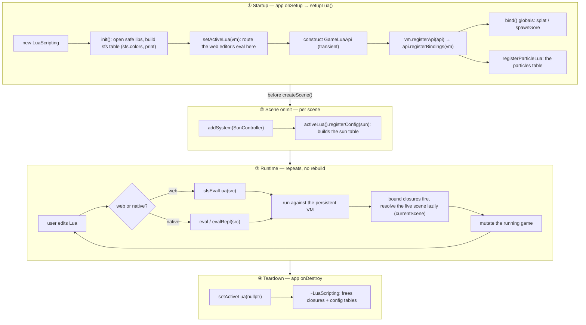

# Lua scripting — game integration guide

How to give a game built on **sfs** a live Lua modding API: editable at runtime,
no rebuild, working on both native and web.

This folder holds the engine's scripting contracts (`LuaScripting`, `ILuaApi`,
`ILuaConfigurable`, the schema + particle helpers). The sample game
(`sampleGame/src/scripting/`) is the **reference implementation** — use it as the
template for your own game. The engine provides the VM and reusable building
blocks; **your game decides what to expose** as its modding surface.

---

## The layering

| Layer | Owns | Examples |
|-------|------|----------|
| **Engine** (`sfs::`) | the VM + reusable building blocks | `LuaScripting`, `ILuaApi`, `ILuaConfigurable`, `registerParticleLua`, the particle prefabs |
| **Game** (your code) | a curated _modding API_ built from those blocks | `GameLuaApi`, `scripting/bindings/*` |

The engine never decides your game's API. You implement one interface
(`sfs::ILuaApi`) and compose the surface from the blocks below.

---

## Lifecycle



- **Startup** stands up the VM and installs the API once (§1–§3). `GameLuaApi` is
  gone after this; the closures it left are owned by the VM.
- The **before `createScene()`** edge is the ordering rule: the VM must exist
  before a scene's `onInit` registers its config (§4).
- **Runtime** reuses the *persistent* VM — re-running a chunk mutates the live
  game (§8). Bindings resolve the current scene at call time, so they survive
  scene changes.
- **Teardown** clears the active VM, then destroys it (§6).

---

## 1. Stand up the VM (app level)

Own the `LuaScripting` instance at the **application** level (it must persist
across scenes), and install your API. In the sample this is `SampleGame`:

```cpp
// sampleGame.cpp
#include "scripting/gameLuaApi.h"
#include <engine/core/scripting/luaScripting.h>

void SampleGame::setupLua()
{
  m_lua = std::make_unique<sfs::LuaScripting>();
  m_lua->init();
  sfs::setActiveLua(m_lua.get()); // routes the web editor's eval here
  m_lua->setConsoleEnabled(true); // expose the in-app console (backtick) -- §8

  GameLuaApi api(*this);          // transient -- see "Lifetimes" below
  m_lua->registerApi(api);        // calls api.registerBindings(*m_lua)
}

void SampleGame::onDestroy()
{
  sfs::setActiveLua(nullptr);     // m_lua is destroyed after this
}
```

> **Ordering gotcha:** `SceneManager::createScene()` runs a scene's `onInit()`
> _synchronously_. If any scene registers config in `onInit` (see §4), call
> `setupLua()` **before** `createScene()` so the VM already exists.

Keep `setupLua` minimal — _only_ VM lifecycle. All actual bindings live in the
files below.

---

## 2. Implement the modding API: `sfs::ILuaApi`

One interface, one method. This is the single entry point the host installs.

```cpp
// scripting/gameLuaApi.h
#include <engine/core/scripting/iLuaApi.h>   // also fwd-declares sfs::LuaScripting

class SampleGame;

class GameLuaApi : public sfs::ILuaApi
{
public:
  explicit GameLuaApi(SampleGame& game) : m_game(game) {}
  void registerBindings(sfs::LuaScripting& lua) override;
private:
  SampleGame& m_game;
};
```

`registerBindings` is _thin_ — it just composes per-API modules:

```cpp
// scripting/gameLuaApi.cpp
#include "scripting/bindings/particleBindings.h"
#include "scripting/bindings/playerBindings.h"

void GameLuaApi::registerBindings(sfs::LuaScripting& lua)
{
  gamebindings::registerParticleBindings(lua, m_game);
  gamebindings::registerPlayerBindings(lua, m_game);
}
```

### Per-API binding modules (`scripting/bindings/`)

Each slice of your API gets one **header-only** file (inline functions in
`namespace gamebindings`). To add an API: drop a `bindings/<name>Bindings.h` with
an inline `register<Name>Bindings(lua, game)` and add one line to
`gameLuaApi.cpp`.

```cpp
// scripting/bindings/playerBindings.h
namespace gamebindings
{
inline void registerPlayerBindings(sfs::LuaScripting& lua, SampleGame& game)
{
  lua.bind("splat",
           [&game]
           {
             /* ... spray gore at the player ... */
           });
}
} // namespace gamebindings
```

---

## 3. The binding building blocks

Pick the lightest tool that fits.

### a) `lua.bind(name, fn)` — simple global functions

For plain triggers and number setters. Your game stays Lua-header-free.

```cpp
lua.bind("pause",   [&game]            { game.pause(); });        // void()
lua.bind("setHp",   [&game](double v)  { game.player().hp = v; });// void(double)
lua.bind("warp",    [&game](double x, double y) { game.warp(x,y); }); // void(double,double)
```

Only those three arities exist. For anything richer (tables, strings, return
values) use a config (§4), an engine helper (§5), or the raw Lua C API via
`lua.state()`.

### b) Resolve live game state _lazily_

Bindings outlive any single scene, so resolve through the game **at call time**,
never capture a scene/system pointer up front:

```cpp
sfs::ParticleEngine* particlesOf(sfs::Scene* scene) {
  if (!scene || !scene->hasSystem<sfs::IsometricRenderSystem>()) return nullptr;
  return scene->getSystem<sfs::IsometricRenderSystem>().module<...>();
}
// inside a bind: particlesOf(game.currentScene())  // re-resolved every call
```

---

## 4. Make a class live-editable: `sfs::ILuaConfigurable`

For a single object with tunable fields, implement `ILuaConfigurable` and the VM
**auto-generates** a `<name>` table — no Lua code at all:

```
<name>.get()      -> table of current values
<name>.set{ ... } -> apply edits, then onLuaConfigChanged()
<name>.options    -> the field schema (key -> hint), for autocomplete
```

```cpp
class SunController : public sfs::System, public sfs::ILuaConfigurable
{
public:
  std::string luaConfigName() const override { return "sun"; }

  sfs::LuaSchema luaConfigSchema() const override {
    return {
      sfs::field("enabled",          &SunController::m_enabled,  "bool"),
      sfs::field("dayLengthSeconds", &SunController::m_dayLen,   "number"),
      sfs::field("timeOfDay",        &SunController::m_time,     "0..1"),
    };
  }

  void* luaConfigData() override { return this; }   // schema offsets apply here

  // set{} writes raw fields (bypassing setters) -- re-validate / react here.
  void onLuaConfigChanged() override { clampAndApply(); }
};
```

Register it where the object lives. A scene can reach the app-owned VM via
`sfs::activeLua()`, and **unregister in the owner's destructor** so a torn-down
object can't be reached from Lua:

```cpp
// in the scene's onInit, after creating the system
auto& sun = addSystem<SunController>();
if (sfs::LuaScripting* lua = sfs::activeLua())
  lua->registerConfig(sun);

// in the system/object destructor
~SunController() override {
  if (sfs::LuaScripting* lua = sfs::activeLua())
    lua->unregisterConfig(*this);   // nils the table; lingering refs no-op
}
```

`unregisterConfig` invalidates the table's backing slot, so even Lua code that
stored a reference (`local s = sun`) safely no-ops afterwards. At app shutdown
`activeLua()` is already null (the VM dies first), making the destructor call a
harmless no-op.

**Schema field builders** (`<engine/core/scripting/luaSchema.h>`):

| Builder | Lua shape | C++ member |
|---------|-----------|------------|
| `field(name, &T::m, hint)` | scalar | `int` / `float` / `bool` / `glm::vec2` |
| `rangeField(name, &T::m, hint)` | `nameMin` / `nameMax` | a `{float min,max}` (e.g. `FloatRange`) |
| `colorField(name, hint)` | `sfs.colors` value | applied by you (maps to your own type) |

> **`ILuaConfigurable` lifetime** — the table reaches the object through an
> invalidatable slot. Either let it outlive the VM, or call `unregisterConfig()`
> before destroying it (as above). Forgetting both is the one way to dangle.
> (Contrast with `ILuaApi`, which is transient — see §6.)

---

## 5. Reuse engine-provided APIs

Some subsystems ship a ready-made table you just wrap. Particles is the example:

```cpp
// scripting/bindings/particleBindings.h
sfs::registerParticleLua(
    lua, "particles",
    [&game] { return particlesOf(game.currentScene()); }); // lazy resolver
```

This installs `particles.spawn / configure / describe / effects / options` driven
by the engine's particle schema. Your game only chooses the table name and how to
find the live engine.

Effect **prefabs** live engine-side too (`<engine/core/particles/particlePrefabs.h>`):
`registerBloodEffects(engine[, prefix, hi, lo])`, `emberEffect()`, etc. Use them
as-is, recolour them, or register your own `ParticleEffectDesc`s — that's the
"games override/extend" path.

---

## 6. Lifetimes & ownership (read this)

- **`LuaScripting`** — app-lifetime. Owned by your `Game` subclass.
- **`ILuaApi` (e.g. `GameLuaApi`)** — _transient_. `registerBindings` runs once;
  the closures it leaves are owned by the VM. So stack-allocate it in `setupLua`.
  Capture the **game** by reference in your lambdas (`SampleGame& game = m_game;`),
  never the `ILuaApi` object — nothing should depend on its lifetime.
- **`ILuaConfigurable`** — outlive the VM, _or_ `unregisterConfig()` before
  destruction (the table's slot is then invalidated, so refs no-op).
- **Don't re-open `namespace sfs`** in game code to forward-declare engine types.
  Include the engine header that declares them (it forward-declares its own types
  where useful). The game only ever _consumes_ `sfs::`.

---

## 7. Safety & sandboxing

The VM is hardened for an interactive console: the common denial-of-service
vectors (infinite loops, memory exhaustion, output flooding) and filesystem
escape are all bounded — a stray or hostile script cannot hang, OOM, or read the
disk. It's still safest to treat the console as a dev/owner tool rather than an
open endpoint for anonymous code.

- **Execution guard.** Every `eval`/`evalRepl` runs under an instruction budget
  (a Lua count hook). A runaway chunk (`while true do end`) is aborted with an
  error instead of hanging the thread — critical on web, where it would freeze
  the tab. Tune with `LuaScripting::setInstructionLimit(n)` (`<= 0` disables).
- **Memory cap.** The VM uses a byte-accounting allocator; an allocation past the
  budget fails as a (caught) out-of-memory error, so a script can't exhaust host
  RAM. Tune with `setMemoryLimit(bytes)` (default 64 MiB, `0` = unlimited);
  `memoryUsed()` reports live bytes.
- **Output cap.** `evalRepl`'s returned string (captured print/log + value) is
  truncated past `setOutputLimit(bytes)` (default 256 KiB) with a marker, so a
  script printing megabytes can't bloat the response handed to the editor.
- **C++ exceptions** thrown by your bound functions / config hooks are caught at
  the C boundary and turned into Lua errors (a raw exception crossing Lua's C
  frames is UB). Your game code can throw without crashing the VM.
- **Sandbox.** Only safe stdlib is opened (no `io` / `os` / `package`), and
  `load` / `loadfile` / `dofile` are removed (they reach the filesystem or load
  raw bytecode). Add a text-only `load` wrapper yourself if a script needs it.
- **Single-threaded.** A `lua_State` is not thread-safe; only drive eval from the
  main thread (where the game loop and the web editor entry already run).

---

## 8. Using it at runtime

### In-app dev console (built in)

A one-line console — toggled with the **backtick** (`` ` ``) key — runs commands
against the live VM without a rebuild. It draws through the engine's
`TextRenderer` (no ImGui dependency), so it ships in **every** build: native
(debug or release) and web.

It's **opt-in**, since it needs a VM to run against: call
`setConsoleEnabled(true)` once after `init()` (see §1). The host then exposes it
automatically — no per-frame code.

While open it owns the keyboard (the game ignores input as you type):

| Key | Action |
|-----|--------|
| `` ` `` | toggle the console |
| Enter | run the line (result / error shows above the prompt) |
| Up / Down | recall previous commands |
| Backspace | edit |
| Escape | close |

Anything bound onto the VM is callable here. With the sample game's API, e.g.
`splat()`, `spawnGore(12, 9)`, `sun.set{ timeOfDay = 0.5 }`, or
`toggleDebug()` (the sample's bound toggle for the native ImGui overlay).

> The flag is read every frame, so it can be flipped live. On web the console and
> the on-page editor share the **same** VM, so a value or binding set in one is
> visible in the other.

### Web editor

The page's Lua console (CodeMirror editor) sends source to the VM via the
exported `sfsEvalLua`; autocomplete comes from `sfsLuaKeys`. Run with
Ctrl/Cmd-Enter or the Run button. (Click the canvas to give input back to the
game and the in-app console; click the editor to type into it.)

### Driving eval directly

You can also call `LuaScripting::eval` / `evalRepl` from your own code (a custom
overlay, a hotkey, a test) — that's all the console and web editor do under the
hood.

Example session (sample game API):

```lua
particles                          -- dump the whole API tree
particles.options                  -- what configure() understands
particles.configure("blood_spray", { burst = 60, color = sfs.colors.Lime })
particles.spawn("embers", 10, 8)
sun.set{ timeOfDay = 0.5, timeMultiplier = 10 }   -- live-edit an ILuaConfigurable
spawnGore(12, 9)                   -- a bound global
```

---

## File map

**Engine scripting API — this folder** (`engine/include/engine/core/scripting/`):

```
luaScripting.h     the VM: init / eval / evalRepl / bind / registerApi / registerConfig
iLuaApi.h          the contract your game implements (registerBindings)
iLuaConfigurable.h       the contract for a live-editable object (get/set/options)
luaSchema.h        field() / rangeField() / colorField() + the reflection reader
particleLuaApi.h   registerParticleLua (the ready-made particle table)
```

**Reference implementation** (`sampleGame/src/scripting/`):

```
gameLuaApi.h/.cpp    sfs::ILuaApi adapter; composes the modules below
bindings/
  particleBindings.h registerParticleBindings (spawnGore global + particles table)
  playerBindings.h   registerPlayerBindings (splat global)
```
